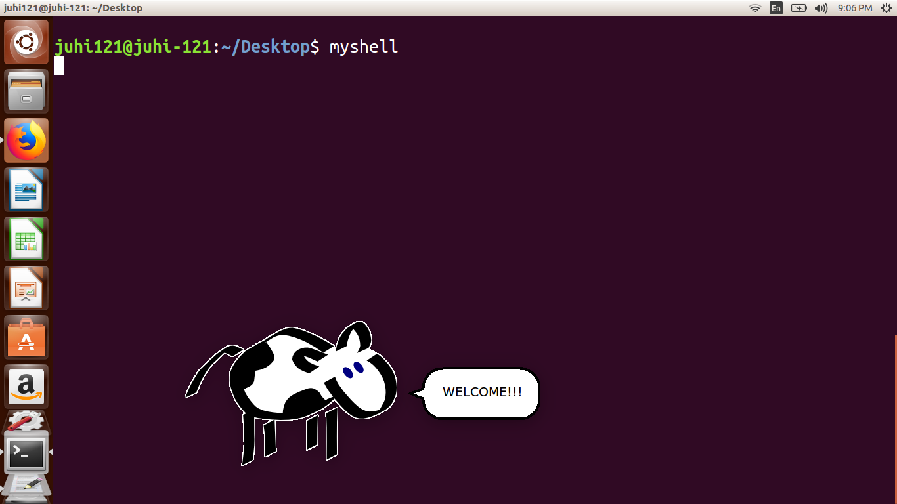
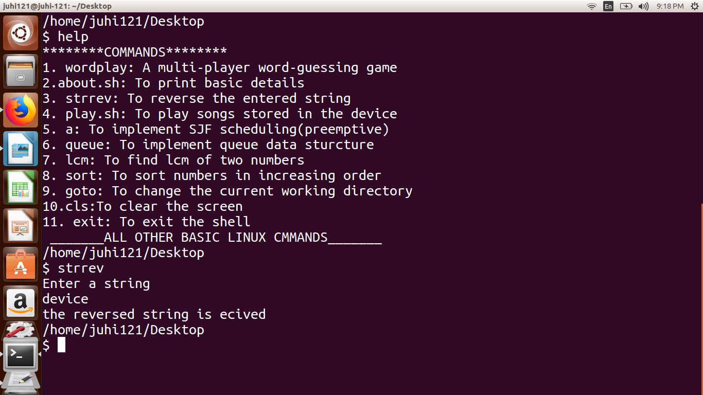
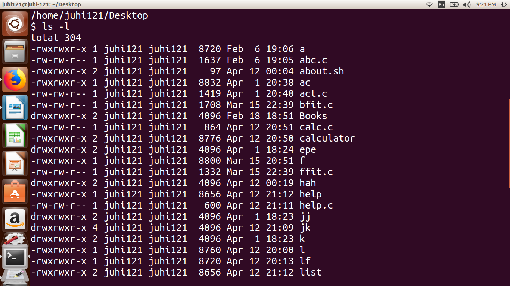
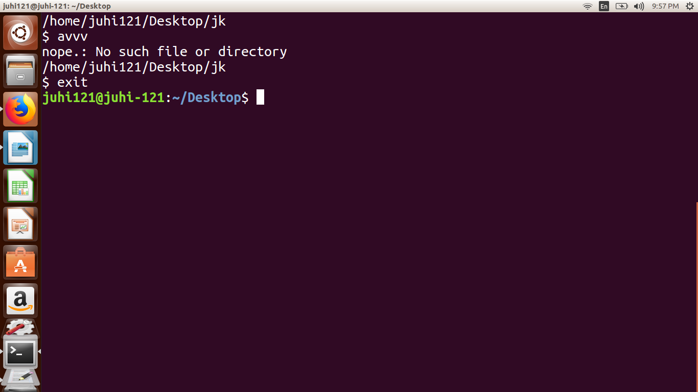

# OS-Project-A-Basic-Linux-Shell-in-C
This is a basic implementation of a linux shell using C language and some in-built UNIX libraries and system calls.
A shell is basically,an interactive program that enables a user to run either the already present linux commands or create their own.

